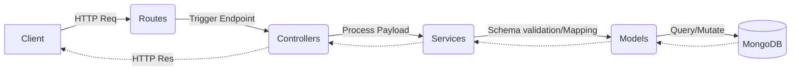

# LogiTrack Backend 🚚

A complete, production-grade Express + MongoDB logistics application backend, rebuilt with modern JS and MVC architecture.

## Features
- **MVC Architecture**: Fully modular design structure for long-term maintainability.
- **Secure Authentication**: Utilizing `bcrypt` password hashing and JWT authorization patterns.
- **Validation Ecosystem**: Comprehensive schema data validation via `joi`.
- **Clean Error Handling**: Centralized error middleware gracefully suppressing execution failures.

## Tech Stack
| Framework | Version | Purpose |
| --------- | ------- | ------- |
| Express   | 4.x     | API Framework |
| Mongoose  | 5.x     | ORM (MongoDB) |
| Joi       | 17.x    | Input Validation |
| Bcrypt    | 5.x     | Secure Hashing |

## Installation Guide
1. Clone the repository natively.
2. Ensure you have Node.js 14+ installed.
3. Install dependencies:
   ```bash
   npm install
   ```

## Environment Variables
Create a `.env` dynamically with the specifications:
| Variable | Description | Default |
| -------- | ----------- | ------- |
| `PORT` | Local runtime port | `3000` |
| `DATABASE_URL` | MongoDB connect remote URL | `mongodb://localhost:27017/logitrack` |
| `JWT_SECRET` | Secret signing value for JWTs | `secret123` |

## Running Locally
```bash
# Start normally
npm start

# Start in dev mode
npm run dev
```

## API Reference
| Endpoint | Method | Auth Required |
| -------- | ------ | ------------- |
| `/api/register` | `POST` | No |
| `/api/login` | `POST` | No |
| `/api/profile`| `GET` | Yes |
| `/api/shipments`| `GET`, `POST` | Yes |
| `/api/shipments/:id`| `GET`, `DELETE` | Yes |
| `/api/shipments/:id/status`| `PATCH` | Yes (Admin) |

## Authentication Flow
1. Client calls `POST /api/register` or `/api/login`.
2. Valid requests yield a signed JWT in the response body.
3. Client appends `Authorization: <token>` to headers on protected route hits.
4. `auth.middleware.js` decodes claims securely.

## Example Requests
```json
// POST /api/login
{
  "email": "admin@example.com",
  "password": "securepassword123"
}
```

## Example Responses
```json
// Status 200 OK
{
  "success": true,
  "msg": "Login OK",
  "token": "eyJhbG..",
  "user": {
    "name": "Admin User"
  }
}
```

## Folder Structure
```text
src/
├── controllers/    # Request handling & HTTP response bindings
├── middlewares/    # Authentication & Error trap abstractions
├── models/         # Database schema Mongoose definitions
├── routes/         # Express endpoint mappings 
├── services/       # Core business workflows & payload processing
├── utils/          # Universal reusable logic and wrappers
├── validators/     # Body payloads schemas checks
└── server.js       # App entrypoint mapping
```

## MVC Architecture Diagram


## Security Features
- Transitioned primitive `MD5` cryptography exclusively towards robust `Bcrypt`.
- Strict authorization barriers avoiding unauthorized modifications and permission escalation.

## Performance Improvements
- Repaired exhaustive DB query iterations natively by implementing native `.populate()` associations resolving explicit N+1 bottlenecks.
- Dropped multiple synchronous execution cycles using native promise-driven queries.

## Future Improvements
- Test-driven Development (TDD) coverage.
- Continuous Integration and Deployment (CI/CD) pipelines.
- Standardized logging system (e.g. Winston).

---
*Created carefully mimicking proper modern engineering methodologies.*